<!-- ========================================================================= -->
<!-- SECTION 1: ANIMATED TERMINAL BOOT SCREEN -->
<!-- ========================================================================= -->

 
 

<!-- ========================================================================= -->
<!-- SECTION 2: LIVE CONTRIBUTION GRAPH -->
<!-- ========================================================================= -->

 
 

<!-- ========================================================================= -->
<!-- SECTION 3: ASCII PORTRAIT & NEOFETCH INFO CARD (SIDE BY SIDE TABLE) -->
<!-- ========================================================================= -->

<table border="0" cellspacing="0" cellpadding="0" align="center" style="border-collapse: collapse; border: none; width: 100%;">
  <tr>
    <td align="center" valign="top" width="50%" style="border: none; padding: 5px;">
      
    </td>
    <td align="center" valign="top" width="50%" style="border: none; padding: 5px;">
      
    </td>
  </tr>
</table>

 
 

<!-- ========================================================================= -->
<!-- SECTION 4: PROJECTS CATALOG -->
<!-- ========================================================================= -->

 
 

<!-- ========================================================================= -->
<!-- SECTION 5: TECHNICAL SKILLS DASHBOARD -->
<!-- ========================================================================= -->

 
 

<!-- ========================================================================= -->
<!-- SECTION 6: CONTACT TERMINAL & SOCIAL CHANNELS -->
<!-- ========================================================================= -->

<table border="0" cellspacing="0" cellpadding="0" align="center" style="border-collapse: collapse; border: none; width: 100%;">
  <tr>
    <td align="center" style="border: none; background: #0A0F1F; border: 1px solid #00E5FF; border-radius: 10px; padding: 20px;">
      <h3 style="color: #00E5FF; font-family: 'JetBrains Mono', monospace; margin-top: 0;">📡 COMMUNICATION_LINK // CONNECT</h3>
      

        Open for collaborations on AI Agents, Deep Learning models, and high-performance backend systems.
      

       
      
      &nbsp;
      
      &nbsp;
      
    </td>
  </tr>
</table>

 
 

<!-- ========================================================================= -->
<!-- SECTION 7: CYBERPUNK AI OS SYSTEM QUOTE / FOOTER -->
<!-- ========================================================================= -->

  <code style="color: #00FFB3; background: #050816; padding: 8px 16px; border-radius: 6px; border: 1px solid #00E5FF;">
    "The best way to predict the future is to invent it with artificial intelligence."
  </code>

  SYSTEM STATUS: <b>ALL_SYSTEMS_OPERATIONAL</b> • POWERED BY AUTOMATED PYTHON & GITHUB ACTIONS

